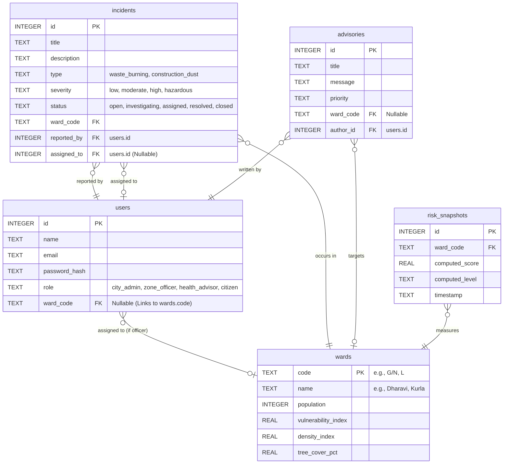

# VayuSetu Mumbai — Capstone Architecture & Viva Guide

This document provides a deep, technically rigorous breakdown of the VayuSetu Mumbai application architecture. Use this to demonstrate a profound understanding of the codebase, internal execution flows, and engineering trade-offs during your Capstone viva.

---

## 1. Core Technical Implementation & Execution Flow

### A. The "Live Ingestion to UI" Execution Pipeline
The most complex flow in the application is how external data is ingested, processed, and pushed to the client. This touches almost every layer of the MERN-equivalent stack.

1. **Trigger (`src/web/App.jsx`):** An admin clicks "Ingest Live Data". A `POST /api/external/ingest-live-inputs` request is fired.
2. **Controller (`src/api/routes/externalDataRoutes.js`):** The Express router validates the JWT and RBAC (`requireRoles("city_admin")`).
3. **External Fetch (`src/api/services/externalDataService.js`):** Makes asynchronous HTTP requests to the Open-Meteo Air Quality and Weather APIs to get baseline Mumbai data (PM2.5, PM10, NO₂, O₃, Wind, Temp).
4. **Processing (`src/api/services/riskService.js` & `src/api/riskEngine.js`):** 
   - The system maps over all 24 wards defined in `src/api/wardCatalog.js`.
   - The `riskEngine.js` algorithm takes the baseline city AQI and applies a mathematical synthesis: `(CityAQI * DensityIndex) - (TreeCoverPct * MitigationFactor)`.
5. **Persistence (`src/api/db.js`):** The synthesized scores are bulk-inserted into the `risk_snapshots` SQLite table.
6. **Event Bus (`src/api/eventBus.js`):** The backend publishes an `input.external.ingested` event to the internal Node `EventEmitter`.
7. **SSE Broadcast (`src/api/routes/alertRoutes.js`):** The Alert router, which holds open `response` objects for all connected clients, intercepts the internal event and writes it to the TCP stream using `res.write(\`data: ${payload}\n\n\`)`.
8. **Client Reactivity (`src/web/App.jsx`):** The `useEffect` hook listening to the `EventSource` receives the message and triggers `loadAll()`, causing React to diff the Virtual DOM and update the UI instantly without a full page reload.

### B. Server-Sent Events (SSE) Implementation
We explicitly chose SSE over WebSockets (like Socket.io) because our data flow is strictly **unidirectional** (Server -> Client). 
- **Backend:** In `src/api/routes/alertRoutes.js`, the `GET /alerts/stream` endpoint sets headers `Content-Type: text/event-stream` and `Connection: keep-alive`. It pushes the `response` object into a `clients` Set. The `eventBus.js` acts as a PubSub broker; when `publishEvent()` is called anywhere in the app, it iterates through the `clients` Set and pushes the JSON payload.
- **Frontend:** In `src/web/App.jsx`, the native browser `EventSource` API connects to the endpoint. We attach event listeners to specific event types (e.g., `incident.created`, `aqi.hazardous`).

### C. JWT Authentication & RBAC Middleware
- **Auth Flow (`src/api/auth.js`):** We use stateless `jsonwebtoken`. The `signAccessToken` function serializes the user's `id`, `role`, and `ward_code` into the payload.
- **Middleware (`src/api/auth.js`):** 
  - `authRequired`: Extracts the Bearer token, verifies the signature using `JWT_SECRET`, and attaches the decoded payload to `request.auth`.
  - `requireRoles(...roles)`: A higher-order function that checks if `request.auth.role` exists within the permitted roles array. If not, it returns a `403 Forbidden` response instantly, short-circuiting the Express middleware chain.

---

## 2. Database Schema (SQLite Relational Model)

The project utilizes SQLite with a strictly normalized relational database design, implemented in `src/api/db.js`.

---

## 3. Viva Preparation: The 8 Mandatory Questions

Use these deeply technical answers to demonstrate your engineering competence.

### Q1: What is the problem your application is solving?
**A:** Mumbai's CAAQMS infrastructure provides city-level AQI, which masks hyper-local pollution crises. VayuSetu solves this by synthesizing granular, **ward-level** air quality intelligence. It combines Open-Meteo API data with deterministic ward characteristics (density, green cover) via our `riskEngine.js`. Furthermore, it implements a closed-loop citizen reporting system (`src/api/routes/incidentRoutes.js`) where localized pollution reports directly impact the ward's composite risk score.

### Q2: Why did you choose your specific technology stack?
**A:** We chose the **Node.js/Express** runtime specifically for its non-blocking, event-driven architecture, which is fundamental for implementing our `EventEmitter`-based PubSub system and SSE streams in `alertRoutes.js`. **React (Vite)** was selected for the frontend because its Virtual DOM allows us to patch the UI reactively when the `EventSource` receives live updates. **SQLite** was chosen because its single-file architecture drastically simplifies deployment to ephemeral containers (like Render), while maintaining strict ACID compliance and standard SQL syntax for an eventual PostgreSQL migration.

### Q3: Explain your system architecture.
**A:** The system follows a decoupled, API-first Client-Server architecture. The React SPA (`src/web`) acts as a thin presentation layer, communicating via a centralized Axios-like wrapper (`apiClient.js`). The Express backend (`src/api`) utilizes controller-based routing (`routes/`), business logic services (`services/`), and a core algorithmic engine (`riskEngine.js`). Real-time capabilities are handled by an internal Node `EventEmitter` (`eventBus.js`) that bridges database mutations to the TCP streams held open by `alertRoutes.js`.

### Q4: How does your backend communicate with the frontend?
**A:** We implemented a hybrid transport layer:
1. **Synchronous REST (JSON):** Standard HTTP GET/POST/PATCH requests with Zod schema validation (`src/api/http/schemas.js`) for CRUD operations and state mutations.
2. **Asynchronous SSE (Server-Sent Events):** Implemented in `alertRoutes.js`, the server maintains `keep-alive` HTTP connections. When a mutation occurs (e.g., an officer is assigned a report), the `publishEvent` hook serializes the JSON payload and writes it directly to the open TCP stream, allowing the React `useEffect` hooks to trigger state updates instantly.

### Q5: What challenges did you face during development?
**A:** Our primary engineering constraint was deriving ward-level granularity from a city-level external API. We engineered around this by building a deterministic synthesis algorithm (`riskEngine.js`). It extracts the base pollutants (PM2.5, NO₂, etc.) from the Open-Meteo payload, computes a baseline AQI, and then applies a mathematical modifier using the `vulnerability_index`, `density_index`, and `tree_cover_pct` stored in `wardCatalog.js`. This allows us to scale horizontally without hardware sensor dependencies.

### Q6: How is your project scalable?
**A:** The architecture scales primarily through its **stateless design**. By implementing JWTs in `auth.js`, the Express server maintains zero session state, meaning it can be horizontally scaled behind a load balancer. Furthermore, we decoupled external API fetching from client requests; instead of passthrough proxying (which would hit Open-Meteo rate limits), the backend ingests data asynchronously, stores it in SQLite, and serves client requests directly from the database memory cache.

### Q7: Explain your database schema design.
**A:** The schema (`src/api/db.js`) is normalized to 3NF. The foundational entity is `wards`. The `users` table handles authentication and RBAC, with a nullable foreign key `ward_code` to restrict a `zone_officer`'s authorization scope. The `incidents` table (citizen reports) utilizes compound foreign keys linking the `reported_by` citizen, the `assigned_to` officer, and the geographic `ward_code`. Finally, `risk_snapshots` serves as an append-only time-series ledger for historical AQI calculations.

### Q8: What improvements would you make in future?
**A:** Architecturally, I would migrate the internal `EventEmitter` in `eventBus.js` to a dedicated Redis Pub/Sub instance to allow for multi-node clustering of the Express backend. At the data layer, I would replace the `riskEngine.js` synthesis algorithm with direct API ingestion from decentralized, ward-specific IoT particulate sensors. 

---

## 4. Complex Engineering Problem (CEP) Matrix

Reference this matrix if asked how VayuSetu meets the CEP requirements:

| CEP Criteria | How VayuSetu Meets It |
|--------------|-----------------------|
| **WP1: Depth of Knowledge** | Implemented custom cryptographic auth (`bcrypt` + JWT), a custom PubSub event bus (`eventBus.js`), and a deterministic risk algorithm (`riskEngine.js`). |
| **WP2: Conflicting Requirements** | Reconciled the requirement for real-time dashboard data with strict external API rate limits by building a centralized, asynchronous ingestion service. |
| **WP3: Depth of Analysis** | Engineered a mathematical model to accurately synthesize ward-level data from broad city-wide data using density and green cover modifiers. |
| **WP4: Familiarity of Issues** | Solved real-time UI synchronization by dropping traditional polling in favor of persistent Server-Sent Events (SSE) via open TCP streams. |
| **WP5: Applicable Codes** | Enforced strict REST API verb conventions, implemented comprehensive Zod input validation (`schemas.js`), and utilized Bcrypt for secure password hashing. |
| **WP6: Stakeholder Involvement** | Engineered a 4-tier RBAC system (Admin, Officer, Advisor, Citizen), where citizen actions directly dictate officer workflows via the `incidents` pipeline. |
| **WP7: Interdependence** | The React UI (`App.jsx`) reacts instantly to Express backend state mutations (`incidentRoutes.js`), which trigger the event bus, pushing via SSE back to the client. |

---

## 5. Deployment Instructions (For Render & Vercel)

### 1. Backend Deployment (Render)
- Go to [Render.com](https://render.com) and click **New → Web Service**.
- Connect your GitHub repository.
- **Root Directory:** `src/api`
- **Build Command:** `npm install`
- **Start Command:** `node server.js`
- Click Deploy. Copy the URL it gives you (e.g., `https://fsd-final-project-api.onrender.com`).

### 2. Frontend Deployment (Vercel)
- Go to [Vercel.com](https://vercel.com) and click **Add New → Project**.
- Import the GitHub repository.
- **Framework Preset:** `Vite`
- **Root Directory:** `src/web`
- **Environment Variables:** Add a new variable named `VITE_API_URL`. Set the value to your Render URL plus `/api` (e.g., `https://fsd-final-project-api.onrender.com/api`).
- Click Deploy. Vercel will give you a live URL for your frontend.
