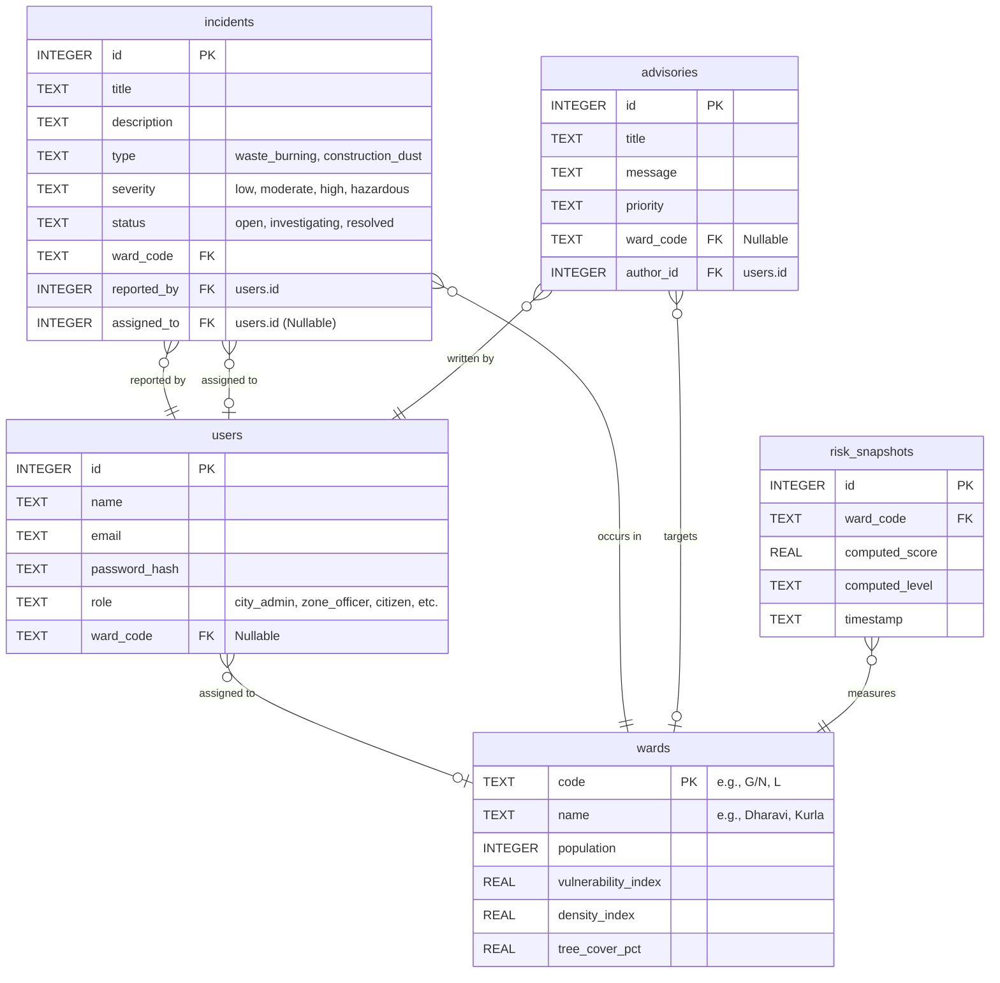

# VayuSetu Mumbai — Capstone Architecture & Viva Guide

This document is your complete guide for the final Capstone (Mini Project) presentation and viva. It is written to clearly explain the core concepts of the project so you can easily understand and defend them.

---

## 1. Core Technical Concepts (Explained Simply)

Before the viva, you should understand these three major concepts that make your project a "Complex Engineering Problem."

### A. What is SSE (Server-Sent Events)?
Usually, when a website wants data, it has to ask the server ("Hey, is there new data?"). This is called polling. 
**Server-Sent Events (SSE)** is a one-way street where the browser connects to the server once, and leaves the connection open. Whenever something happens on the backend (like new AQI data being ingested, or a new pollution report being filed), the server instantly pushes a message down that open connection. 
* **Why it matters:** It makes your dashboard update instantly in real-time without the user having to refresh the page.

### B. What is JWT (JSON Web Tokens) & Role-Based Access Control?
Instead of saving user sessions in the database, when a user logs in, the server gives them a cryptographically signed token (the JWT). The frontend sends this token with every request.
* **Role-Based Access Control (RBAC):** Inside the token, we store the user's role (`city_admin`, `zone_officer`, `health_advisor`, or `citizen`). When an API request comes in, the server checks this role. For example, the server will block a `citizen` from accessing the `POST /external/ingest-live-inputs` route, returning a `403 Forbidden` error.

### C. The Custom Risk Engine
External APIs only provide a single Air Quality reading for the *entire* city of Mumbai. We wanted ward-level data.
Instead of faking the data, we use a custom algorithm in `riskEngine.js`:
1. We take the real city-wide pollutant levels (PM2.5, NO2, etc.).
2. We multiply them by a specific ward's **Density Index** (Dharavi has higher density than Malabar Hill, so its risk goes up).
3. We reduce the risk based on the ward's **Tree Cover Percentage** (more trees = better air filtration).
* **Why it matters:** It shows you didn't just display an API response on a screen; you engineered a custom algorithm to synthesize localized data using geographic characteristics.

---

## 2. Database Schema (ER Diagram)

The project uses SQLite with a highly normalized relational database design. 

---

## 3. Viva Preparation: The 8 Mandatory Questions

Use these plain-English answers to confidently defend your project.

### Q1: What is the problem your application is solving?
**A:** Mumbai faces severe, localized air quality crises. Existing tools like SAFAR only provide broad, city-level AQI data. VayuSetu solves this by providing **ward-level** air quality intelligence. It takes city-wide API data and synthesizes it with ward-specific characteristics like population density and green cover. Furthermore, it creates a feedback loop: citizens can report localized pollution (like waste burning), and ward officers can investigate it directly through the platform.

### Q2: Why did you choose your specific technology stack?
**A:** We chose the **MERN-equivalent stack (React + Express + Node + SQLite)**. 
- **Node/Express** is perfect for our backend because its asynchronous nature handles our real-time Server-Sent Events (SSE) effortlessly. 
- **React** allows us to build a dynamic dashboard that instantly updates when new live data arrives without refreshing the page. 
- **SQLite** was chosen for fast relational database development, and because we used standard SQL, we can easily migrate to PostgreSQL if the city scaled this up.

### Q3: Explain your system architecture.
**A:** The architecture is an API-first client-server model. 
- The **Frontend (React)** is purely a presentation layer that talks to the backend via a RESTful API.
- The **Backend (Express)** handles all business logic. It has a custom Risk Engine that fetches environmental data from the Open-Meteo API, calculates ward-level risk scores, and saves them to the SQLite Database. 
- Finally, the backend uses **Server-Sent Events (SSE)** to push real-time alerts down to the React frontend the exact second the database changes.

### Q4: How does your backend communicate with the frontend?
**A:** It communicates via two methods:
1. **REST APIs (JSON):** The frontend makes standard HTTP GET, POST, and PATCH requests to fetch data, log in, or submit pollution reports.
2. **Server-Sent Events (SSE):** The backend maintains an open, one-way HTTP connection to the browser. If an admin clicks "Recompute AQI", the backend pushes an event through the SSE stream, and the frontend instantly updates the graphs and tables.

### Q5: What challenges did you face during development?
**A:** Our biggest challenge was data granularity. The free external APIs only give a single AQI reading for the whole of Mumbai, but our problem statement required ward-level tracking. We solved this by creating a custom math algorithm (`riskEngine.js`). It takes the baseline city AQI and modifies it based on each specific ward's density index and tree cover percentage. This allowed us to generate 24 accurate, localized risk scores without needing physical sensors.

### Q6: How is your project scalable?
**A:** 
1. **Stateless Authentication:** Because we use JSON Web Tokens (JWT) instead of storing user sessions in the database, our Node server is completely stateless and can be scaled horizontally.
2. **Decoupled API Polling:** Instead of thousands of users individually hitting the Open-Meteo API (which would hit rate limits immediately), our backend fetches the API data once, saves it to our database, and serves the data to users from our own database.

### Q7: Explain your database schema design.
**A:** We designed a highly normalized relational schema. The core table is `wards`, which holds static data like population and tree cover. The `users` table holds accounts linked to specific roles, and can be tied to a ward via a foreign key. The `incidents` table tracks citizen pollution reports and links to the user who reported it and the officer assigned to it. Finally, `risk_snapshots` tracks the historical AQI scores for every ward over time.

### Q8: What improvements would you make in future?
**A:** Currently, our ward-level data is synthesized via an algorithm. If this were deployed by the BMC, we would integrate direct IoT sensor feeds from actual CAAQMS monitoring stations installed in each ward. Additionally, we could add a machine learning model to predict what the AQI will be 24 hours in the future based on historical wind and temperature patterns.

---

## 4. Complex Engineering Problem (CEP) Matrix

If the evaluators ask how this qualifies as a "Complex Engineering Problem", reference this matrix:

| CEP Criteria | How VayuSetu Meets It |
|--------------|-----------------------|
| **WP1: Depth of Knowledge** | Wrote a custom risk engine algorithm, implemented JWT stateless auth, and designed a robust relational DB. |
| **WP2: Conflicting Requirements** | Solved the conflict of needing real-time data vs. strict external API rate limits by building a centralized ingestion system. |
| **WP3: Depth of Analysis** | Engineered a mathematical model to synthesize ward-level data from city-wide data using density and green cover modifiers. |
| **WP4: Familiarity of Issues** | Implemented persistent Server-Sent Events (SSE) for modern real-time dashboard updates. |
| **WP5: Applicable Codes** | Adhered to strict REST API conventions, used Zod for request validation, and Bcrypt for secure password hashing. |
| **WP6: Stakeholder Involvement** | Engineered a 4-role system (Admin, Officer, Advisor, Citizen), where citizen actions (pollution reports) dictate officer workflows. |
| **WP7: Interdependence** | The React UI reacts instantly to Express backend state changes, which in turn are triggered by external Python/Meteo API data. |

---

## 5. Deployment Instructions (For Render & Vercel)

### 1. Backend Deployment (Render)
- Go to [Render.com](https://render.com) and click **New → Web Service**.
- Connect your GitHub repository.
- **Root Directory:** `src/api`
- **Build Command:** `npm install`
- **Start Command:** `node server.js`
- Click Deploy. Copy the URL it gives you (e.g., `https://fsd-final-project-api.onrender.com`).

### 2. Frontend Deployment (Vercel)
- Go to [Vercel.com](https://vercel.com) and click **Add New → Project**.
- Import the GitHub repository.
- **Framework Preset:** `Vite`
- **Root Directory:** `src/web`
- **Environment Variables:** Add a new variable named `VITE_API_URL`. Set the value to your Render URL plus `/api` (e.g., `https://fsd-final-project-api.onrender.com/api`).
- Click Deploy. Vercel will give you a live URL for your frontend.
